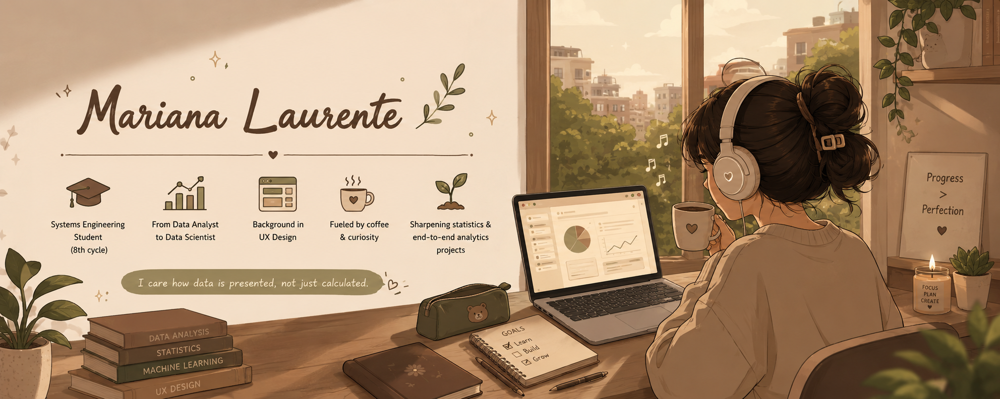

  

<h3 align="center">
🍂 Systems Engineering Student • Aspiring Data Analyst • UX-curious 🍂
</h3>

  

 

## 🌰 About Me

╭ ───────── 🤎 ───────── ╮

🎓 Systems Engineering student (8th cycle), Peru 
📊 Building my path from data analyst to data scientist 
🎨 Background in UX design — I care how data is presented, not just calculated 
☕ Fueled by coffee and curiosity 
🌱 Currently sharpening statistics & end-to-end analytics projects

╰ ───────── 🤎 ───────── ╯

  <i>"Turning raw data into decisions, one query at a time." ☕</i>

 

## 💻 Tech Stack

  

 

## 📊 GitHub Activity

<!-- Replace YOUR-GITHUB-USERNAME below (appears 3 times total in this file) with your real GitHub username -->

---

## 🔥 GitHub Streak

 

## 🎯 Currently Focused On

📈 Building an end-to-end data analysis portfolio 
🔍 Practicing SQL + Power BI + Python on real datasets 
📐 Strengthening statistics for the leap into data science 
💼 Applying for data analyst internships 

 

## 📫 Let's Connect

<!-- Replace with your real links -->

 

 

🤎 🍂 🤎 🍂 🤎 🍂 🤎

 

<h3>☕ Thanks for stopping by ☕</h3>

